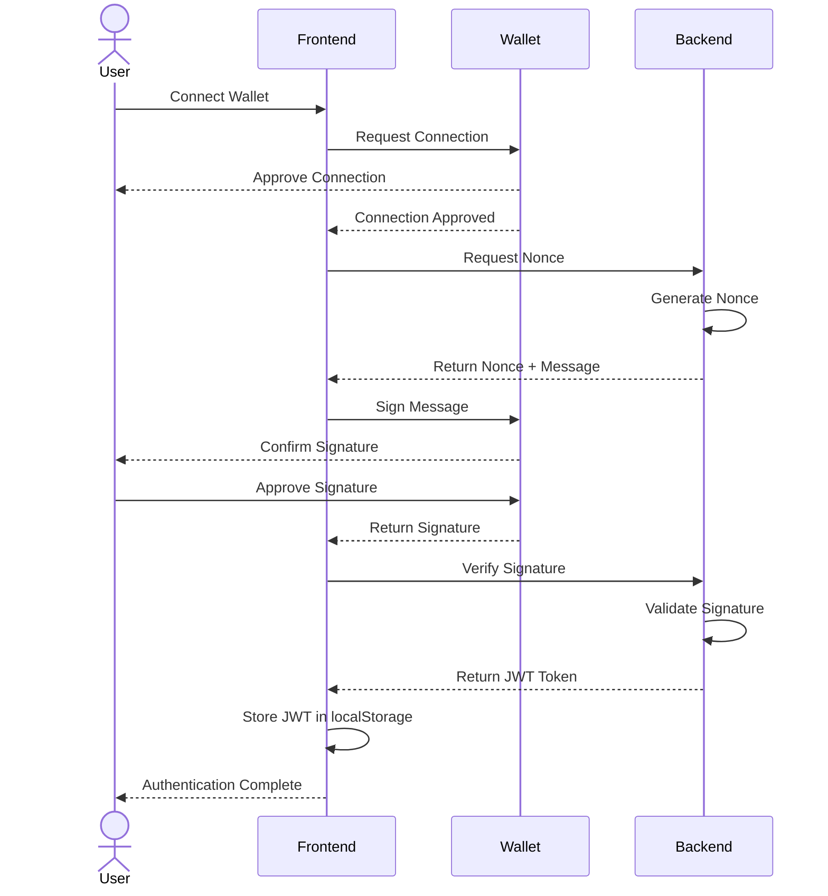

# WisePrompt Frontend

This is the frontend for the WisePrompt application, featuring wallet-based authentication using RainbowKit, wagmi, and viem with Next.js.

## Getting Started

1. Copy the `.env.local.example` file to `.env.local` and fill in the required variables:

   ```bash
   cp .env.local.example .env.local
   ```

2. Install dependencies:

   ```bash
   npm install
   # or
   yarn install
   ```

3. Run the development server:

   ```bash
   npm run dev
   # or
   yarn dev
   ```

4. Open [http://localhost:3000](http://localhost:3000) with your browser to see the result.

## Wallet Authentication Flow

The application implements a secure wallet-based authentication flow using EIP-4361 (Sign-In with Ethereum):

1. User connects their Ethereum wallet using RainbowKit
2. Upon connection, the app requests a nonce from the backend
3. The user signs the nonce with their wallet
4. The signed message is sent to the backend for verification
5. If valid, the backend issues a JWT token
6. The JWT token is stored in localStorage
7. The token is included in subsequent API calls in the Authorization header

## Implementation Details

### Key Components

- `Web3Provider`: Sets up RainbowKit and wagmi configuration
- `AuthProvider`: Manages authentication state
- `ConnectWallet`: Custom connect button component
- `ProtectedRoute`: HOC for routes that require authentication
- `ApiClient`: Makes authenticated API requests

### Authentication Flow



### API Authentication

All subsequent API requests include the JWT token in the Authorization header:

```typescript
// Example API call
const response = await apiClient.get("/protected-route");
```

The token is automatically injected by the `ApiClient` instance.

## Protected Routes

To protect routes that require authentication, wrap them with the `ProtectedRoute` component:

```tsx
export default function ProtectedPage() {
  return <ProtectedRoute>{/* Your protected content here */}</ProtectedRoute>;
}
```

## Directory Structure

- `/providers`: Contains context providers (Web3Provider, AuthProvider)
- `/components`: Reusable components
- `/hooks`: Custom hooks
- `/services`: API and auth services
- `/pages`: Next.js pages
- `/styles`: CSS styles

## Environment Variables

- `NEXT_PUBLIC_API_URL`: Backend API URL
- `NEXT_PUBLIC_WALLETCONNECT_PROJECT_ID`: WalletConnect Project ID
- `NEXT_PUBLIC_ALCHEMY_API_KEY`: Alchemy API Key (optional)
